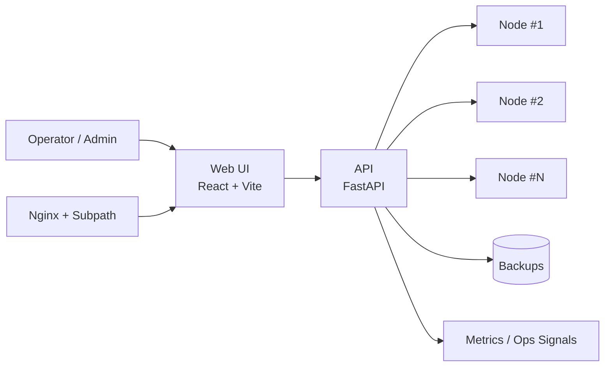

# Multi-Server Subscription Manager

> Единая control-plane панель для multi-node инфраструктуры: управление узлами, клиентами, подписками и эксплуатацией — в одном интерфейсе.


---

## Почему это удобно

`multiserversubgen` создан для сценария, где серверов и клиентов уже много, а хаоса должно быть мало.

Вы получаете:

- централизованное управление несколькими узлами;
- операции с inbound/client (включая batch-подход);
- мониторинг статуса и health-сигналов;
- backup/restore без ручного «танца с бубном»;
- production-ориентированный install/update pipeline.

## Что внутри 🚀

| Область | Возможности |
|---|---|
| Node management | Добавление/удаление узлов, контроль доступности |
| Inbounds & Clients | Управление, фильтрация, batch-операции |
| Traffic & Analytics | Статистика трафика и operational срезы |
| Backup / Restore | Экспорт/импорт данных, базовые recovery-сценарии |
| Ops-ready runtime | `systemd`, `nginx`, subpath-деплой, health-check |

## Быстрый старт

### 1) Установка

```bash
git clone https://github.com/Efidripy/multiserversubgen
cd multiserversubgen
chmod +x install.sh
sudo ./install.sh
```

Что настраивается автоматически:

- backend (FastAPI + venv);
- frontend-сборка (Vite) с публикацией в `backend/build`;
- `systemd`-сервис `sub-manager`;
- `nginx`-маршрутизация для subpath;
- базовые security/ops элементы профиля.

### 2) Проверка работоспособности

```bash
systemctl is-active sub-manager
APP_PORT="${APP_PORT:-666}"
curl -s -o /dev/null -w 'health=%{http_code}\n' "http://127.0.0.1:${APP_PORT}/health"
```

Публичная проверка панели:

```bash
curl -fsSL -o /dev/null -w 'panel=%{http_code}\n' https://<your-domain>/<web-path>/
```

### 3) Обновление

```bash
cd multiserversubgen
git pull
sudo ./update.sh
```

Перед обновлением рекомендуется сделать backup через API.

## Архитектура (на пальцах)



Ключевые директории:

- `backend/` — API и сервисная логика;
- `frontend/` — интерфейс управления;
- `scripts/installer/` — пресеты и installer-flow;
- `monitoring/`, `nginx/`, `systemd/` — инфраструктурный слой.

## Документация

### Стартовая база

- [Установка](./docs/INSTALL.md)
- [Обновление](./docs/UPDATE.md)
- [Эксплуатация (Ops)](./docs/OPS.md)
- [API (входная точка)](./docs/API.md)

### Глубже

- [Полная API-документация](./docs/API_DOCUMENTATION.md)
- [Гайд по компонентам](./docs/COMPONENTS_GUIDE.md)
- [Гайд по подпискам](./docs/SUBSCRIPTION_GUIDE.md)
- [Текущий remediation roadmap](./docs/REMEDIATION-ROADMAP-2026-08-10.md)
- [Исторический снимок улучшений](./docs/IMPROVEMENTS.md)

## Практичные заметки для production

- Минимум: Ubuntu 20.04+ (рекомендуется 24.04), root, домен/поддомен.
- Аутентификация: защищённая browser-сессия/API-аутентификация для панели и административных API; публичные subscription URLs используют стабильные opaque tokens и должны обслуживаться только по HTTPS. Их ручная регенерация инвалидирует предыдущую ссылку.
- Для subpath-сценария фронтенд должен быть собран с корректным `VITE_BASE`.

## Лицензия

Проект распространяется по лицензии [MIT](./LICENSE).
