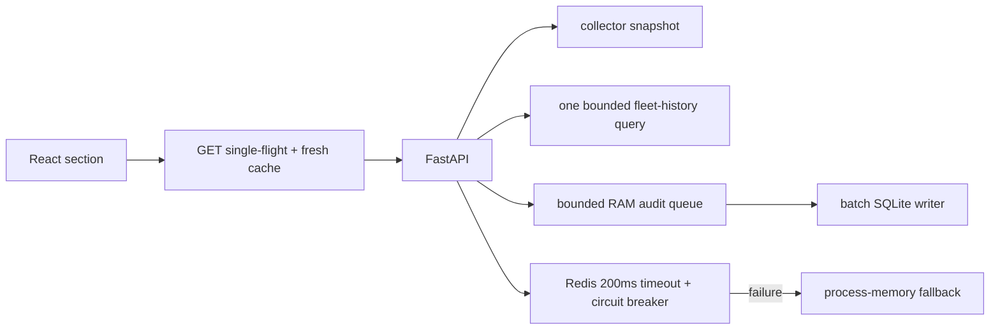

# PERF-01 — ускорение навигации и доступов к данным

**Статус:** implemented locally, pending production measurement
**Task:** `TASK-20260817-MSSG-PERF-01`
**Каноническая связь:** дополняет `REMEDIATION-ROADMAP-2026-08-10.md`; не заменяет её.

## Цель

Сократить задержку при открытии разделов без ослабления актуальности данных:

- не запускать одинаковые cold-запросы параллельно;
- не выполнять SQLite commit из HTTP middleware;
- получать fleet history одним ограниченным запросом вместо запроса на каждый узел;
- не давать неисправному Redis занимать worker threads;
- читать из SQLite только данные, нужные текущему экрану.

## Архитектурное решение

SQLite остаётся основной локальной БД. Миграция на PostgreSQL не входит в PERF-01: текущая проблема была в fan-out, синхронных commit и широких чтениях, а не в пределе SQLite для подтверждённой нагрузки.

## Реализованные изменения

| Область | Файлы | Результат |
| --- | --- | --- |
| Frontend transport | `frontend/src/api/client.ts` | Одинаковые cacheable GET одного пользователя объединяются до первого ответа; запросы с `AbortSignal` намеренно не объединяются, чтобы отмена одного consumer не отменяла другой. |
| Monitoring | `frontend/src/components/MonitoringDashboard.tsx` | Fleet history получает один endpoint; auxiliary AdGuard/stack загрузки отложены на 750 ms; поздние history-ответы не перезаписывают новый scope. |
| History read model | `backend/routers/operations.py` | `GET /api/v1/history/nodes` возвращает максимум `limit_per_node` точек на узел одним SQLite query. |
| Audit | `backend/services/runtime_support.py`, `backend/core/lifespan.py` | Middleware помещает событие в bounded RAM queue; фоновый worker выполняет batch insert и drain. Shutdown делает один bounded best-effort flush. |
| Redis | `backend/services/runtime_support.py`, `backend/core/app_settings.py` | `REDIS_SOCKET_CONNECT_TIMEOUT_SEC`, `REDIS_SOCKET_TIMEOUT_SEC`, `REDIS_FAILURE_COOLDOWN_SEC` по умолчанию ограничивают сбой Redis и включают immediate fallback. |
| Cache stampede | `backend/services/clients_runtime.py`, `backend/services/inbounds_runtime.py` | Cold miss clients/inbounds сериализован на ресурс: один caller делает fleet fetch, остальные читают заполненный cache. |
| SQLite projection | `backend/services/client_notes.py` | Notes выбираются только для клиентов текущего ответа порциями не более 300 identity. |
| Измеримость | `backend/core/request_middleware.py` | Ответ содержит `Server-Timing: app;dur=...`; Prometheus использует route template, когда Starlette его разрешил, вместо raw path с идентификаторами. |

## Runtime параметры

| Переменная | Значение по умолчанию | Назначение |
| --- | ---: | --- |
| `AUDIT_MEMORY_QUEUE_MAX` | `2000` | Жёсткий предел непросмотренных audit-событий в памяти. |
| `AUDIT_QUEUE_BATCH_SIZE` | `200` | Максимум событий одного SQLite batch. |
| `REDIS_SOCKET_CONNECT_TIMEOUT_SEC` | `0.2` | Предел подключения к Redis. |
| `REDIS_SOCKET_TIMEOUT_SEC` | `0.2` | Предел одной Redis операции. |
| `REDIS_FAILURE_COOLDOWN_SEC` | `30` | Пауза перед следующей попыткой после Redis error. |

Параметры не следует менять без `Server-Timing`, browser waterfall и фактических p95/p99. Особенно нельзя повышать `TRAFFIC_MAX_WORKERS` вслепую: на малом хосте он может быть выставлен installer resource guard в `1`.

## Проверка и дальнейшие TODO

Локальная регрессия PERF-01 покрывает memory-only audit enqueue, Redis circuit breaker, single-flight cold miss, filtered client notes, fleet-history bound и frontend GET coalescing.

До production-вывода остаются внешние, неавторизованные в этой задаче действия:

1. Снять read-only browser waterfall и p50/p95 по реальному URL.
2. Проверить активные `TRAFFIC_MAX_WORKERS` и `COLLECTOR_MAX_PARALLEL` без restart/change.
3. При подтверждённом Redis включить его health/timeout метрики; при нескольких uvicorn workers не полагаться на process-local cache.
4. Решить retention/drop policy для audit queue: PERF-01 сохраняет отзывчивость HTTP, поэтому при заполнении bounded queue события могут быть потеряны при overload или аварийном завершении процесса.

## Критерии приёмки

- переход в monitoring не создаёт HTTP request history на каждый node;
- параллельные равные GET выполняют один network adapter call;
- HTTP request не открывает SQLite connection для audit enqueue;
- Redis error возвращает управление в memory fallback в пределах заданного timeout/cooldown;
- история и client notes сохраняют прежний формат ответов;
- production latency не заявляется подтверждённой до отдельного live receipt.
